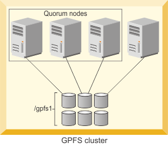

# GPFS Notes

GPFS stands for General Parallel File System, a high-performance clustered file system developed by IBM. It is now known as IBM Spectrum Scale, reflecting its broader role in IBM's storage software portfolio. GPFS is widely used in enterprise environments, particularly in scenarios requiring high performance, scalability, and reliability.

## Quorum: 
{ align=right }
In GPFS, quorum must be maintained during node failures to keep the cluster online. If quorum is lost, GPFS unmounts local file systems and attempts to reestablish it, triggering file system recovery. Quorum nodes participate in voting to maintain consistency, requiring a simple majority of these nodes to remain active for continued operation.

### Cluster Manager:

There is one GPFS cluster manager per cluster. The cluster manager is chosen through an election held
among the set of quorum nodes designated for the cluster.

### File System manager
There is one file system manager per file system, which handles all of the nodes using the file system.
The services provided by the file system manager include:

### CES node (Protocol Node):

In a GPFS cluster, nodes can be designated as CES nodes using `mmchnode --ces-enable`, enabling them to serve protocols like NFS, SMB, Object, Block, and HDFS. CES nodes require supported operating systems. At least two protocol nodes (CES nodes) are recommended for high availability, allowing non-GPFS clients to access GPFS-managed data via exports, shares, or containers. These nodes must have "external" network addresses for client access, distinct from internal GPFS cluster addresses. CES supports protocol IP failover between nodes, ensuring seamless client access during node failures.

Usually the cluster compiled of an odd number of nodes for example 2 manager nodes and protocol node to be operational. as a safety thing you might need additional protocol node to fallover it in case of failure happening 

i will try to enlist most of the commands needed to gather info about the cluster which is needed during any maintenance or perodic checks:

### Concepts

**Recovery Groups (RG):** IBM Spectrum Scale RAID divides disks into recovery groups where each is physically connected to two servers: primary and backup. All accesses to any of the disks of a recovery group are made through the active server of the recovery group, either the primary or backup.

*   A recovery group is conceptually the internal GPFS equivalent of a hardware disk controller. Within a recovery group, individual JBOD disks are defined as pdisks and assigned to declustered arrays. Each pdisk belongs to exactly one declustered array within one recovery group. Within a declustered array of pdisks, vdisks are defined. The vdisks are the equivalent of the RAID logical unit numbers (LUNs) for a hardware disk controller. One or two GPFS cluster nodes must be defined as the servers for a recovery group, and these servers must have direct hardware connections to the JBOD disks in the recovery group. Two servers are recommended for high availability server failover, but only one server will actively manage the recovery group at any given time. One server is the preferred and primary server, and the other server, if defined, is the backup server.

**Declustered Array (DA):** is a subset of the physical disks (pdisks) in a recovery group across which data, redundancy information, and spare space are declustered. 

## Disk configurations

**Virtual disk (vdisk):** is a type of NSD, implemented by IBM Spectrum Scale RAID across all the physical disks (pdisks) of a declustered array. Multiple vdisks can be defined within a declustered array.

**Physical disk (pdisk):** 
A pdisk is used by GPFS Native RAID to store both user data and GPFS Native RAID internal
configuration data.
A pdisk is either a conventional rotating magnetic-media disk (HDD) or a solid-state disk (SSD). All
pdisks in a declustered array must have the same capacity.
Pdisks are also assumed to be dual ported; with one or more paths connected to the primary GPFS
Native RAID server and one or more paths connected to the backup server. There are typically two
redundant paths between a GPFS Native RAID server and connected JBOD pdisks.

## Clustered configuration repository (CCR) 

The clustered configuration repository (CCR) is used by GPFS and many other IBM Spectrum Scale components like GUI, the CES services and the monitoring service to store files and values across the cluster, and to return requested files and values to the caller.  
The CCR is also responsible for electing the cluster manager and for notifying registered nodes about CCR file and value updates by using the User Exit Script callback mechanism. Nearly all mm-commands use the CCR function. The master copy of the IBM Spectrum Scale configuration file, `mmsdrfs`, is located in the CCR, and each mm-command tries to pull the current version of the file out of the CCR. The mm-command tries to extract the latest version of the `mmsdrfs` file in case the local version of this configuration file is outdated.  
The information maintained by the CCR is stored redundantly on each quorum node and optionally on one or more tiebreaker disks. The CCR state consists of files and directories under `/var/mmfs/ccr`, as well as the CCR state cached in the memory of the appropriate GPFS daemon. The consistency of CCR state replicas is maintained using a majority consensus algorithm. This means the CCR state from a majority of quorum nodes or tiebreaker disks must be available for the CCR to function properly. For example, a cluster with just one or two quorum nodes and no tiebreaker disks, has zero fault tolerance. In case of an unavailable CCR state on one of the quorum nodes, the cluster complains of quorum loss. In case the CCR state is unavailable on both quorum nodes, the cluster complains of a broken cluster. You can create fault tolerance by assigning more quorum nodes or tiebreaker disks.

**You can get an unavailable CCR state due to one of the following reasons:**

*   A quorum node has failed, which results in a temporarily unavailable CCR state. In such cases, you must wait until the node restarts.
    
*   A quorum node is permanently lost due to a hardware failure. This includes hardware failure of the internal disk containing the /var/ file system.
    
*   Complete or partial corruption of /var/. For example, a hard power-off of VM host results in the files in /var/mmfs/ccr and its sub-directories being truncated to zero length. For information on how to recover cluster configuration information when no CCR backup is available.
    

## Inodes

The metadata for each file is stored in the inode and contains information such as file size and time of last modification. The inode also sets aside space to track the location of the data of the file. On file systems that are created in IBM Spectrum Scale v3.5 or later, if the file is small enough that its data can fit within this space, the data can be stored in the inode itself. This method is called data-in-inode and improves the performance and space utilization of workloads that use many small files. Otherwise, the data of the file must be placed in data blocks, and the inode is used to find the location of these blocks. The location-tracking space of the inode is then used to store the addresses of these data blocks. If the file is large enough, the addresses of all of its data blocks cannot be stored in the inode itself, and the inode points instead to one or more levels of indirect blocks. These trees of additional metadata space for a file can hold all of the data block addresses for large files. The number of levels that are required to store the addresses of the data block is referred to as the indirection level of the file.

To summarize, on file systems that are created in v3.5 or later, a file typically starts out with data-in- inode. When it outgrows this stage, or if the file system was created before v3.5, the inode stores direct pointers to data blocks; this arrangement is considered a zero level of indirection. When more data blocks are needed, the indirection level is increased by adding an indirect block and moving the direct pointers there; the inode then points to this indirect block. Subsequent levels of indirect blocks are added as the file grows. The dynamic nature of the indirect block structure allows file sizes to grow up to the file system size.
