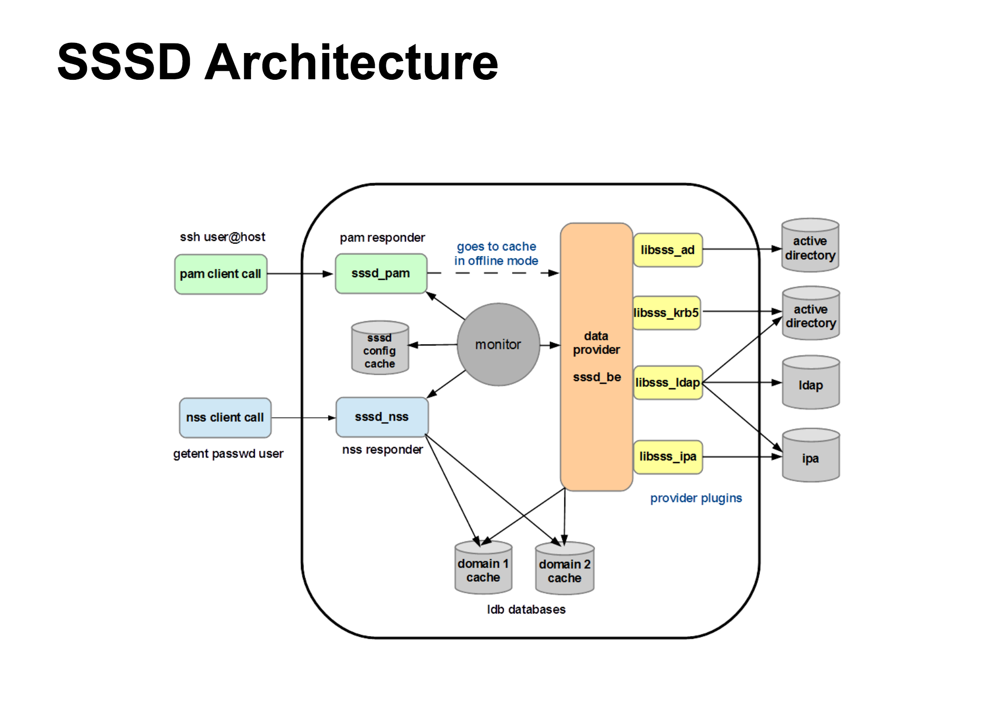

## Abstract

1.  PAM, NSS and SSSD are present locally on the OS.
    
2.  Any call made to OS for authenticating or authorization results in a call to PAM/NSS SSSD responders then eventually to AD or LDAP.
    
3.  SSSD is configured in sssd.conf to contact AD for authentication 
    
4.  SSSD can maintain AD id-mapping cache locally on the OS but we didn't use that option in our setting.
    
5.  SSSD will lookup both in the external source and locally to get user -> password or user name to -> uid , uid-> username, group name to gid, gid-> group name etc.
    

Workflow:

1.  configure the sssd.conf and add **nss** and **pam** as responders
    
2.  configure nsswitch.conf to be compatable with SSS
    
3.  use pam-config tool to seamlessly add SSS to pam modules/lib  without breaking anything.
    
4.  now everything will go through SSSD through the responders 
    



The SSSD daemon (Running locally on the Linux OS) will control the login process. The login program communicates with the configured `pam` and `nss` modules, which in this case are provided by the SSSD package. These modules communicate with the corresponding SSSD responders, which in turn talk to the SSSD Monitor.  
SSSD looks up the user in the AD directory.

NSS is there to enumerate information from ad about services/users (what group you belong to, where your home directory is etc). PAM determines what to do about that information. and all of that is under SSSD.


Local:

how SSSD work with PAM, NSS,krb5 and AD:

*   SSSD
    
*   NSS
    
*   PAM
    
*   krb5
    

## SSSD: System Security Services Daemon

since pam and nss are complex to configure with no offline auth capability. traditional Linux auth we can authenticate locally and one and only one remote source whether ldap or krb5

we can use SSSD we can authenticate to multiple identity stores  and it works as a gateway of some sort which allows us to use a central location for different services in a single conf file 

SSSD uses a parent/child process monitoring model:   
[sssd] Parent process, Monitor  
[nss] [pam] Child process, Responder  
[domain/AD] Child process, Provider

SSSD configuration is found in `/etc/sssd/sssd.conf` 

??? example "sssd.conf example"

    [sssd]   **#the monitor**  
    config_file_version = 2  
    domains = < domain> **#specify the authentication domains that this daemon is going to serve**  
    services = nss, pam    **#indicate which responders to invoke** 

    [nss]  **#the responder which is a child process or the monitor**  
    filter_groups = root guest  
    filter_users = root guest **#the local users that the sssd should not return in a search**  
    reconnection_retries = 5 **#how many the monitor will restart the responder if it crashed**

    [pam] **#the responder which is a child process or the monitor**  
    reconnection_retries = 5 **#how many the monitor will restart the responder if it crashed**

    [domain/< domain>] **#have to match the name mentioned above in the domains option**    
    enumerate = False   **#if it true the daemon will cache all the data which can take a lot of time**    
    cache_credentials = False   **#if true it will allow users to log in if the authentication source goes offline**    
    case_sensitive = False   **#if true can impose some usability issues**  
    use_fully_qualified_names = False  
    ignore_group_members = True    
    ldap_purge_cache_timeout = 0  
    dns_discovery_domain = < domain>      
    id_provider = ad   **#we will use ad provider to lookup the ids**    
    auth_provider = ad **#we authenticate against Active Directory**  
    ad_domain = < domain>    
    ad_enabled_domains = < domain>      
    ad_site = < physical location>   
    ad_server = dc1,dc2,dc3     
    dyndns_update = False   
    ldap_id_mapping = True    
    ldap_schema = ad **#the daemon understand the Active Directory schema**     
    ldap_search_base = DC=< interal>,DC=< uk>,       
    override_homedir = /home/%u  **#this will create a sub-directory for the user**       
    fallback_homedir = /home/%u      
    default_shell = /bin/bash  
    min_id = 10000   
    krb5_ccname_template=FILE:%d/krb5cc_%U     
    debug_level = 7 **#it can be from 0 to 9**   


logs : `/var/log/sssd/` 

cache: `/var/lib/sss/db/`


## NSS: Name Service Switch

The nsswitch. conf file commonly controls searches for users (in passwd), passwords (in shadow), host IP addresses, and group information and defines the search order of the network databases.

**NSS** - A module based system for controlling how various OS-level databases are assembled in memory. This includes (but is not limited to) `passwd`, `group`, `shadow` (this is important to note), and `hosts`. UID lookups use the `passwd` database, and GID lookups use the `group` database.

NSS conf are in `/etc/nsswitch.conf`


??? example "nsswitch.conf example"

    passwd:        compat sss  
    group:        compat sss

    hosts:      files dns  
    networks:    files dns

    services:    files  
    protocols:    files  
    rpc:        files  
    ethers:        files  
    netmasks:    files  
    netgroup:    files nis  
    publickey:    files

    bootparams:    files  
    automount:    files nis  
    aliases:    files


## Authselect 

Authselect is a tool to select system authentication and identity sources from a list of supported profiles. It is a replacement for authconfig

use  `authselect list`  to check current in place system authentication methods:


conf file in `/etc/authselect/user-nsswitch.conf`

??? example "user-nsswitch.conf Example"
    
    ```
    #/etc/nsswitch.conf  
    #In order of likelihood of use to accelerate lookup.  
    passwd:      sss files systemd  
    shadow:     files sss  
    group:       sss files systemd  
    hosts:      files dns myhostname  
    services:   files sss  
    netgroup:   sss  
    automount:  files sss

    aliases:    files  
    ethers:     files  
    gshadow:    files  
    #Allow initgroups to default to the setting for group.  
    #initgroups: files  
    networks:   files dns  
    protocols:  files  
    publickey:  files  
    rpc:        files
    ```

## PAM: Pluggable Authentication Modules

**PAM** - A module based system for allowing service based authentication and accounting. Unlike NSS, you are not extending existing databases; PAM modules can use whatever logic they like, though shell logins still depend on the `passwd` and `group` databases of NSS. (you always need UID/GID lookups).PAM does nothing on its own. If an application does not link against the PAM library and make calls to it.

several changes is done in  `/etc/pam.d/` we added SSS module `pam_sss.co` 

files that have the module are: `common-account`  `common-auth`  `common-password`  `common session` 


!!! example "PAM Modules Examples"

    === "`common-account`"
        account    requisite     pam_unix.so    try_first_pass   
        account    sufficient    pam_localuser.so   
        account    required      pam_sss.so    use_first_pass  
        
    === "`common-auth`"
        auth    required      pam_env.so      
        auth    sufficient    pam_unix.so    try_first_pass   
        auth    required      pam_sss.so    use_first_pass  

    === "`common-password`"
        password    requisite    pam_cracklib.so      
        password    sufficient    pam_unix.so    use_authtok nullok shadow try_first_pass   
        password    required    pam_sss.so    use_authtok  

    === "`common session`"
        session optional    pam_mkhomedir.so    umask=066  
        session    optional    pam_systemd.so  
        session    required    pam_limits.so      
        session    required    pam_unix.so    try_first_pass  
        session    optional    pam_sss.so      
        session    optional    pam_umask.so        
        session    optional    pam_env.so  

## krb5 (Kerberos): Network Authentication Protocol

Kerberos is used to authenticate entities requesting access to network resources, especially in large networks to support SSO. 

our use case :

1.  to initially join the system to the domain and generate the key-tab file ( contains encoded credentials used by the Linux system itself to pre-authenticate  to active directory ).
    
2.  to allow normal active directory users to pre-authenticate to perform tasks that require a krb connections.
    

conf are in `/etc/krb5.conf`
logs: `/var/log/krb5/kadmind.log` 


??? example "krb5.conf Example"

    [libdefaults]  
        default_realm = < default realm>   
        clockskew = 600  
        dns_lookup_kdc = false  
        dns_lookup_realm = false  
        udp_preference_limit = 128  
        forwardable = true  
        default_ccache_name = FILE:/tmp/krb5cc_%{uid}  

    [realms]  
        <domain> = {  
            admin_server = <domain-controller1 > 
            default_domain = < default domain> 
            kdc = <domain-controller1 > 
            kdc = <domain-controller2  >
            kdc = <domain-controller3  >
            master_kdc = <domain-controller1 >
        }

    [domain_realm]  
            < default domain> = < default domain>  

    [logging]  
        kdc = FILE:/var/log/krb5/krb5kdc.log  
        admin_server = FILE:/var/log/krb5/kadmind.log  
        default = SYSLOG:NOTICE:DAEMON  

    [appdefaults]  
        pam = {  
            ticket_lifetime = 1d  
            renew_lifetime = 1d  
            forwardable = true  
            proxiable = false  
            minimum_uid = 10000  
            clockskew = 300  
            external = sshd  
            use_shmem = sshd  
        }


### Authentication process with krb5

Steps for authentication to a remote server via krb5  

1. create a new keytab for easier login instead of repeatingly writing the password 

    `kadmin -p <username>`

2. authenticate using the keytab

    `kinit <username> -k -t /root/<username>.keytab`  
            
3. we check if the ticket is successfully cached using `klist` 
   
4. authenticate the machine to Active Directory 
        
    `adcli -v join -C --show-details`

        
5. in case we want to change the domain controller for any reason 
        
    `net ads join -k -S <domain-controller1>`


     


## NIS: Network Information Service 

it has a daemon `nis-domainname.service`  which Read and set NIS domainname from /etc/sysconfig/network


## OpenLDAP 

useful for searching AD to validate ,objects attributes and values outside the context of the SSSD or MMC and it useful for troubleshooting AD connectivity issues.

   * LDAP clients like openldap that provides `ldapsearch` command  `/etc/openldap/ldap.conf`  
   * override the /etc/openldap/ldap.conf for user sessions `/.ldaprc`  
   * LDAP daemon uses `/etc/ldap.conf`  
   * SAMBA conf `/etc/openldap/schema/samba.schema`

??? example "ldap.conf Example"

    BASE           DC=< interal>,DC=< uk>  
    URI            ldap://192.168.xx.xx  

    TLS_REQCERT        allow  
    TLS_CACERTDIR        /etc/ssl/certs  
    TLS_CIPHER_SUITE    AES256-SHA:xx-xx-xx

    REFERRALS OFF #because active directory returns referrals that are only meaningful to other AD servers they are not meaningful to openLDAP systems or clients  
    SASL_NOCANON ON  


## CLI Query from AD

??? "wbinfo - Query information from winbind daemon"

    wbinfo -i < username >       #Get user info  

    wbinfo -S < SID >       #sid-to-uid  
    wbinfo -s < SID >       #sid-to-name  
    wbinfo -n < username >       #returns user SID

    wbinfo -a < username >       #request password input for the user and the daemon will check with AD if is correct

    wbinfo -n < group name >        #return group sid

    wbinfo -Y < SID >    #sid-to-gid

    wbinfo --all-domains   #current domain that we are part of

    wbinfo -D < domain >   #Show most of the info we have about the domain

    wbinfo -g  #show all groups     

    wbinfo --dc-info=< domain >  #show the currently known domain controllers


??? "net.samba3 - Tool for administration of Samba and remote CIFS servers"

    net idmap check               #will give the local database status 

    net user info < username >       #groups associates with the user from AD

    net groupmap list           # list the groups mapped locally **\*gpfs doesn't see the groups from AD**

    net ads info  -d 4    #info about our AD with increased debugging level to 4 

    net ads search sAMAccountName=ahnasr   #ALL user info from AD

    net ads group   #list AD groups 

    net ads status

    net ads keytab list #inspect keytab file that was created when the system joined the domain. 

??? Useful Commands
    "adcli - Tool for performing actions on an Active Directory domain"  
    adcli info < domain >   
    adcli join -C #to join the domain after generating krb keytab  

    "ctdb - clustered tdb database management utility"  
    ctdb getdbmap  

    "getent - get entries from administrative database"  
    getent passwd < username >  
    getent sss

    "LDAP query
    ldapsearch cn=< username >
   
    "local query"
    id < username >
    groups< username >


## Reset ID-Mapping in GPFS

1. First run the following commands
    
    systemctl stop gpfs-smb
    systemctl stop gpfs-winbind
    
2. Go to `/var/lib/gpfs-samba` backup (just in case) and delete:  `msg.sock/winbindd_privileged/  netsamlogon_cache.tdb`  `smbprofile.tdb`  `winbindd_cache.tdb` since this is where the old id-maps.
    
3.  Run commands
    
    systemctl start gpfs-smb
    systemctl start gpfs-winbind
    net conf import /etc/samba/smb.conf
    
4.  To initiate the new mapping run:   
    `wbinfo -i <username>`  #this should give uid and primary gid
    
5.  Checks: You can use `wbinfo -n <username>`  to get the SID of a user, then `net cache flush`  and `wbinfo -S <SID>` which should show user uid.
    


??? References

    *  http://manpages.ubuntu.com/manpages/precise/en/man1/wbinfo.1.html
    *   [https://ubuntu.com/server/docs/service-sssd-ad](https://ubuntu.com/server/docs/service-sssd-ad)
        
    *    winbind based [https://help.ubuntu.com/community/ActiveDirectoryWinbindHowto](https://help.ubuntu.com/community/ActiveDirectoryWinbindHowto)  
        
    *   IBM smb [https://www.youtube.com/watch?v=Aj-rfZikNXM](https://www.youtube.com/watch?v=Aj-rfZikNXM)
        
    *   great guide [https://web.mit.edu/rhel-doc/5/RHEL-5-manual/Deployment\_Guide-en-US/s1-samba-servers.html](https://web.mit.edu/rhel-doc/5/RHEL-5-manual/Deployment_Guide-en-US/s1-samba-servers.html)
        
    *   check if u r using winbind or sssd [https://access.redhat.com/documentation/en-us/red\_hat\_enterprise\_linux/7/html-single/windows\_integration\_guide/index#smb-sssd-switch](https://access.redhat.com/documentation/en-us/red_hat_enterprise_linux/7/html-single/windows_integration_guide/index#smb-sssd-switch) >> `alternatives --display cifs-idmap-plugin`
        
    *   samba MASTER GUIDE [https://man.archlinux.org/man/smb.conf.5.en](https://man.archlinux.org/man/smb.conf.5.en)
        
    *   ALL SAMBA CONF OPTIONS [https://admx.help/?Category=admx-samba&Policy=admx-samba-alt3.noarch::POL\_066B06D4\_3BC0\_5CFA\_80A9\_D2B1C046B5B0](https://admx.help/?Category=admx-samba&Policy=admx-samba-alt3.noarch::POL_066B06D4_3BC0_5CFA_80A9_D2B1C046B5B0)
        
    *   samba sample conf [https://wiki.samba.org/index.php/Ldapsam\_Editposix#Samba\_and\_the\_Editposix.2FTrusted\_Ldapsam\_extension](https://wiki.samba.org/index.php/Ldapsam_Editposix#Samba_and_the_Editposix.2FTrusted_Ldapsam_extension)
        
    *   samba idmap conf [https://wiki.samba.org/index.php/Idmap\_config\_ad](https://wiki.samba.org/index.php/Idmap_config_ad)
        
    *   how SSSD works [https://access.redhat.com/documentation/en-us/red\_hat\_enterprise\_linux/8/html/configuring\_authentication\_and\_authorization\_in\_rhel/understanding-sssd-and-its-benefits\_configuring-authentication-and-authorization-in-rhel](https://access.redhat.com/documentation/en-us/red_hat_enterprise_linux/8/html/configuring_authentication_and_authorization_in_rhel/understanding-sssd-and-its-benefits_configuring-authentication-and-authorization-in-rhel)
        
    *   SSSD lecture [https://www.youtube.com/watch?v=Iq6W1QfT6IY](https://www.youtube.com/watch?v=Iq6W1QfT6IY)
        
    *   SSSD deployment lecture [https://www.youtube.com/watch?v=lf66X7jIMQI](https://www.youtube.com/watch?v=lf66X7jIMQI)
        
    *   more on SSSD conf [https://access.redhat.com/documentation/en-us/red\_hat\_enterprise\_linux/7/html/system-level\_authentication\_guide/configuring\_domains#Configuring\_Domains-Configuring\_a\_Native\_LDAP\_Domain](https://access.redhat.com/documentation/en-us/red_hat_enterprise_linux/7/html/system-level_authentication_guide/configuring_domains#Configuring_Domains-Configuring_a_Native_LDAP_Domain)
        
    *   SSSD conf guide [https://jhrozek.fedorapeople.org/sssd/1.9.91/man/sssd.conf.5.html](https://jhrozek.fedorapeople.org/sssd/1.9.91/man/sssd.conf.5.html)
        
    *   SSSD ad [https://linux.die.net/man/5/sssd-ad](https://linux.die.net/man/5/sssd-ad)
        
    *   SSSD ldap [https://linux.die.net/man/5/sssd-ldap](https://linux.die.net/man/5/sssd-ldap)
        
    *   configuring GPFS to do the auth [https://www.ibm.com/docs/en/spectrum-scale/5.0.4?topic=access-configuring-ad-based-authentication-file](https://www.ibm.com/docs/en/spectrum-scale/5.0.4?topic=access-configuring-ad-based-authentication-file) -- check the current auth `mmuserauth service list` >> [https://www.ibm.com/docs/en/spectrum-scale/4.2.2?topic=reference-mmuserauth-command](https://www.ibm.com/docs/en/spectrum-scale/4.2.2?topic=reference-mmuserauth-command)
        
    *   [https://community.cloudera.com/t5/Community-Articles/Understanding-Security-basic-for-dummies/ta-p/247315](https://community.cloudera.com/t5/Community-Articles/Understanding-Security-basic-for-dummies/ta-p/247315)
        
    *   [https://community.cloudera.com/t5/Community-Articles/How-PAM-NSS-SSD-work-together-on-Linux-OS/ta-p/247879](https://community.cloudera.com/t5/Community-Articles/How-PAM-NSS-SSD-work-together-on-Linux-OS/ta-p/247879)
        
    *   [https://learn.microsoft.com/en-us/previous-versions/tn-archive/bb463152(v=technet.10)?redirectedfrom=MSDN#introduction-and-goals](https://learn.microsoft.com/en-us/previous-versions/tn-archive/bb463152(v=technet.10)?redirectedfrom=MSDN#introduction-and-goals)
